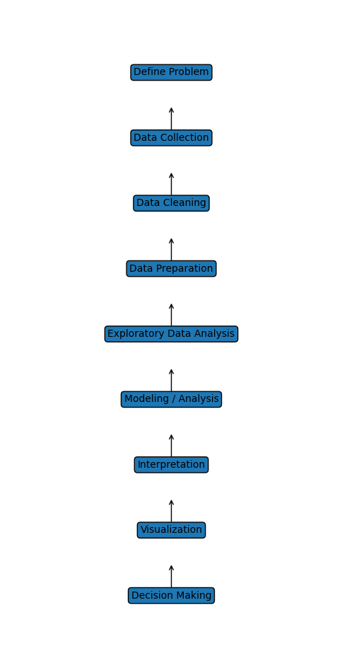

# Data Analysis Process

# Data Analysis Roadmap with Machine Learning

core concept of data science for  begning

1.data loading by using web scrapping or from csv excell file 

2.basic function implement on data by using pandas 

3.ON data apply conditional filtering  by using loc,iloc,between ,isin

4.Data cleaning on numeric column by using mean median,mod, frequent record
